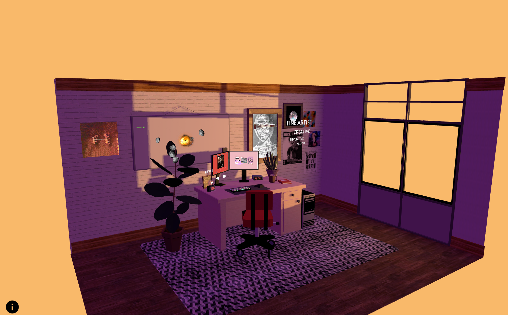

# [3D-CV](https://samuel-morgan-tyghe.github.io/3d-Desk-CV/dist/index.html)

An arrangement of projects displayed using three.js Library

* Optimisation for GPU and Loading times, clean coding, file optimisation.
* Model Creation, lighting, geometry, material, textures.
* Css3d, Ray-casting , API's, p5js, baking, loading manager, post processing.

Technologies & Tools: Blender, Three.js, WebGL, p5js, API, webpack, threex, draco-compression, basis compression, gsap, moment.js, XML, RSS, Photoshop, wordpress.

